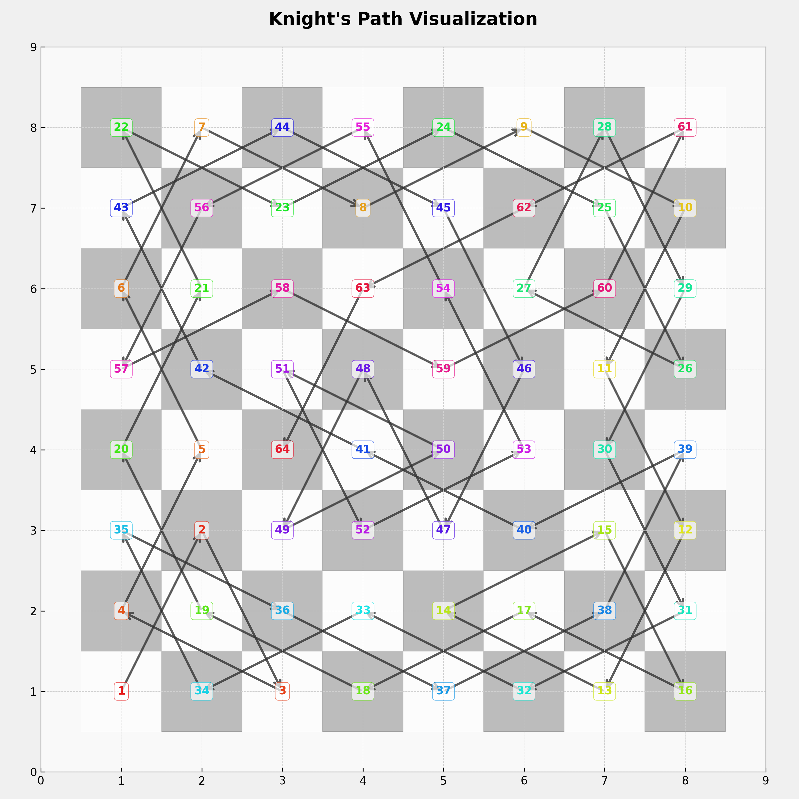

# Knight's Tour Solver and Visualizer

This project solves the Knight's Tour problem using various search strategies and visualizes the resulting path. The Knight's Tour is a sequence of moves by a knight on a chessboard such that the knight visits every square exactly once.

## Features

- **Search Strategies**: Supports Breadth-First Search (BFS), Depth-First Search (DFS), and heuristic-guided DFS variants.
- **Time Limit Handling**: Allows setting a time limit for the search.
- **Logging**: Detailed logs of the search process and results.
- **Visualization**: Generates a visual representation of the knight's path using Python.

## Installation

### Prerequisites
- **Java 11+**
- **Python 3.6+**
- Python Libraries: `matplotlib` (install via `pip install matplotlib`)

### Steps
1. Clone the repository.
2. Compile the Java files:
   ```bash
   javac *.java
## Usage

### Running the Solver
1. Execute the compiled Java program:
   ```bash
   java Main
   ```
2. Follow the prompts to:
    - Enter the board size (e.g., `8` for an 8x8 board).
    - Choose a search strategy (`1` for BFS, `2` for DFS, etc.).
    - Set a time limit in minutes.

   Example output:
   ```
   Nodes Created  -> 10,234
   Nodes Expanded -> 8,192
   Time spent     -> 0.45.123
   ```

3. The solution path (if found) is saved to `path.txt`.

### Visualizing the Path
1. Run the Python visualization script:
   ```bash
   python VisualizePath.py
   ```
2. The script checks if the path is valid and generates `path_visualization.png`.



## Project Structure

| File               | Description                                                                 |
|--------------------|-----------------------------------------------------------------------------|
| `Main.java`        | Entry point. Handles input, logging, and coordinates the search.           |
| `Node.java`        | Represents a node in the search tree (knight's position and state).        |
| `Problem.java`     | Contains problem configuration (board size, time limit, statistics).       |
| `TreeSearch.java`  | Implements BFS, DFS, and heuristic-based search algorithms.                |
| `VisualizePath.py` | Python script to visualize the knight's path from `path.txt`.              |

## Strategies

1. **BFS** (Breadth-First Search): Explores all nodes at the current depth before moving deeper.
2. **DFS** (Depth-First Search): Explores as far as possible along each branch before backtracking.
3. **DFS_H1B**: DFS with Warnsdorff’s heuristic (prioritizes moves with the fewest onward options).
4. **DFS_H2**: Enhanced heuristic combining Warnsdorff’s rule and proximity to board corners.

## Logging and Results

- **Logs**: Saved to `logs/logs.log` with timestamps, node counts, and runtime.
- **Output**:
    - `path.txt`: Contains the knight's path as a list of coordinates.
    - Console logs display search statistics.

## Visualization Details

- **Chessboard Grid**: Dynamically sized based on the board dimensions.
- **Annotations**: Each step is numbered with a color gradient.
- **Validity Check**: The script verifies that all moves are valid knight moves.

## Example Usage

```
# Solve a 5x5 board with DFS_H1B and a 10-minute time limit
$ java Main
> Board size: 5
> Strategy: 3
> Time limit: 10

# Visualize the result
$ python VisualizePath.py
Valid input coordinates.
```